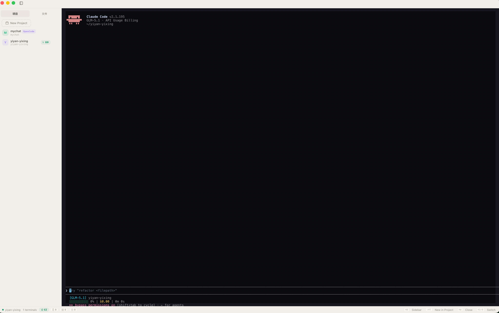

# OneCode Desktop

> 原生桌面客户端，一个窗口管理多个 AI 终端。以 Claude Code 为内核，让一人公司开发者在一个窗口内创建、切换、复用多个终端会话。

OneCode Desktop 是 [OneCode](https://github.com/yiyan-yixing/onecode) 的桌面形态。Web 版跑在 Docker 容器里靠浏览器访问，多任务只能开多个浏览器标签——切标签丢现场、标签不持久、无法后台常驻。Desktop 用原生窗口解决：多终端 Tab、托盘常驻、会话配置持久化。



## 功能亮点

- 🖥️ **多终端管理** — 一个窗口内创建、切换、关闭多个 Claude Code 终端
- 📁 **项目面板** — 左侧项目卡片，一键切换或创建终端
- 🔍 **探索面板** — 查看所有 Agent 和会话，点击 Agent 插入 `@id`，点击会话切换终端
- 🔴 **实时状态** — 终端运行/退出/崩溃状态一目了然
- 🏷️ **Agent @mention** — 输入 `@` 弹出 Agent 列表，快速调用 @dev、@architect 等
- 💾 **会话持久化** — 终端配置自动保存，重启恢复
- 🩺 **健康检测** — 自动检测僵尸进程、内存异常，状态栏告警
- 🔌 **托盘常驻** — 关窗不退出，托盘菜单快速操作

## 安装

从 [GitHub Releases](https://github.com/yiyan-yixing/onecode-desktop/releases) 下载最新 DMG 安装包，拖入 Applications 即可。

> 目前仅支持 macOS Apple Silicon (M1/M2/M3/M4)。

## 架构

```
┌─────────────────────────────────────────────────────────┐
│                 OneCode Desktop (Tauri v2)               │
│                                                          │
│   Frontend (WebView, Vanilla JS + xterm.js)              │
│     TabManager ── createTab / switchTo / closeTab        │
│        │ onData()  Channel<Vec<u8>> ──► xterm.write()    │
│        │                                                 │
│   ──────┤ invoke (请求/响应)   ├── Channel (流式二进制) ──┤
│        ▼                                                 ▼
│   Rust Backend                                           │
│     commands.rs  ── pty_spawn / kill / write / resize …  │
│     MultiPtyManager (RwLock<HashMap<Uuid, TerminalSlot>>) │
│       ├─ PTY 读取线程 ──► mpsc ──► 16ms 批量合并任务      │
│       └─ RingBuffer (10MB/slot) ──► Tab 切换 replay       │
│     SessionStore (rusqlite) · TrayIcon · 健康检测循环     │
│     CcStatusCache ──► 读 ~/.claude 的 skills/agents/…    │
│     CcSessionsCache ──► 读 ~/.claude 的会话转录           │
│                                                          │
│   Frontend (WebView)                                     │
│     OrbitalController (项目/探索面板) · CcStatusView (徽章)    │
│     MentionController (@弹窗) · PaletteController (⌘K)   │
└──────────────────────────────────────────────────────────┘
```

## 技术栈

| 层 | 选型 | 理由 |
|---|---|---|
| 桌面框架 | **Tauri v2** | ~5-8MB 安装包（Electron ~200MB），WebView 复用 xterm.js |
| 后端语言 | **Rust** | `portable-pty` 跨平台 PTY，无 GC，内存可控 |
| PTY | **portable-pty** | WezTerm 维护，macOS/Linux 一等公民 |
| IPC | **`Channel<Vec<u8>>`** | 原生二进制流式传输，零 base64 编码开销 |
| 并发 | **`RwLock<HashMap>`** | write/resize/list 读锁并发，spawn/kill 写锁低频 |
| 前端 | **Vanilla JS (ES Module)** | 与 Web 版一致，无构建链负担 |
| 终端 | **xterm.js** + fit/web-links/webgl addon | 从 node_modules 同步到 `static/` |
| 持久化 | **rusqlite (bundled)** | 自包含 SQLite，存终端配置（不存内容） |

## 目录结构

```
onecode-desktop/
├── src-tauri/            Rust 后端
│   ├── Cargo.toml        依赖：tauri2 / portable-pty / rusqlite / serde / tokio
│   ├── .cargo/config.toml  Cargo target-dir → ../target（产物统一到项目根目录）
│   ├── tauri.conf.json   窗口 1200×800、打包配置（dmg/appimage/deb/msi/nsis）
│   ├── capabilities/     IPC 权限白名单
│   └── src/
│       ├── lib.rs        入口：Builder.setup + invoke_handler + 启动恢复
│       ├── pty/          PTY 核心：MultiPtyManager / TerminalSlot / RingBuffer
│       │   ├── mod.rs       RwLock 管理 + snapshot + kill_all_blocking
│       │   ├── slot.rs      TerminalSlot + RingBuffer + SlotStatus
│       │   └── health.rs    僵尸/RSS 健康检测（每 5s 轮询）
│       ├── commands.rs   invoke 命令（Channel<Vec<u8>> + cc_status + sessions）
│       ├── cc_status.rs  CC Status：读 ~/.claude 的 skills/hooks/agents…
│       ├── cc_sessions.rs CC Sessions：读 ~/.claude 的会话转录，提取标题
│       ├── session/      SQLite 会话持久化（自动保存 + 启动恢复）
│       ├── tray.rs       系统托盘常驻（新建/显示/退出 + 关窗隐藏）
│       └── config.rs     应用配置
├── src/                  前端 WebView
│   ├── index.html        骨架（标题栏 + 项目面板 + 终端 + 状态栏徽章）
│   ├── styles.css        Cowork 暖色主题
│   ├── ipc-bridge.js     Tauri invoke + Channel 封装
│   ├── cc-status.js      状态栏徽章 + agent 数据源
│   ├── orbital.js        左侧面板（项目/探索双 Tab + 终端 orb）
│   ├── palette.js        命令面板（⌘K）
│   ├── ripple.js         通知涟漪动画
│   └── terminal/         TabManager / xterm / @mention / 滚动条 / IME
├── static/               运行时同步的 xterm/marked/hljs（.gitignore，生成物）
├── scripts/copy-static.sh  从 node_modules 同步静态资源
└── .github/workflows/    CI（cargo check）+ Release（macOS DMG）
```

## 开发

### 前置依赖

- **Rust** (stable) + `cargo`
- **Node.js** 18+
- **Tauri 系统依赖**：
  - macOS：Xcode Command Line Tools
  - Linux：`webkit2gtk-4.1`、`libgtk-3`、`libayatana-appindicator3` 等（见 [Tauri prerequisites](https://v2.tauri.app/start/prerequisites/))
- **Claude Code CLI** 已安装（终端默认启动 `claude --permission-mode bypassPermissions`）

### 首次运行

```bash
make install          # npm install
make copy-static      # 同步 xterm/marked/hljs 到 static/
# 准备应用图标（首次需要）：
#   放一张 ≥1024×1024 的 PNG，执行：
#   npx @tauri-apps/cli icon ./path/to/app-icon.png
make dev              # cargo tauri dev，热重载
```

### 构建

```bash
make build            # 产出 .dmg (macOS) / .AppImage+.deb (Linux) / .msi+.exe (Windows)
```

产物位于 `target/release/bundle/`。

| 平台 | 安装包格式 | 路径 |
|---|---|---|
| macOS | `.dmg` | `target/release/bundle/dmg/` |
| macOS | `.app` | `target/release/bundle/macos/` |
| Linux | `.AppImage` | `target/release/bundle/appimage/` |
| Linux | `.deb` | `target/release/bundle/deb/` |
| Windows | `.msi` | `target/release/bundle/msi/` |
| Windows | `.exe` (NSIS) | `target/release/bundle/nsis/` |

### 测试

```bash
npm test              # Node.js 前端测试（153 断言）
make test             # Rust 单元测试
make check            # clippy + fmt + test
```

## 快捷键

| 快捷键 | 功能 |
|---|---|
| `Cmd/Ctrl + B` | 折叠/展开侧边栏 |
| `Cmd/Ctrl + E` | 打开探索面板（Agent + Session 列表） |
| `Cmd/Ctrl + T` | 新建终端 |
| `Cmd/Ctrl + Shift + T` | 在当前项目目录新建终端 |
| `Cmd/Ctrl + W` | 关闭当前终端 |
| `Cmd/Ctrl + 1~9` | 切换到第 N 个终端 |
| `Cmd/Ctrl + Shift + [ / ]` | 上 / 下一个终端 |
| `Cmd/Ctrl + K` | 打开命令面板 |
| 输入 `@` | 触发 Agent @mention 弹窗（↑↓ 选择、Enter 确认、Esc 取消） |

## 发布流程

推送 `v*` tag 触发 GitHub Actions 自动构建 macOS DMG：

```bash
git tag v0.1.0
git push origin v0.1.0
```

构建完成后自动创建 GitHub Release 并上传 DMG 安装包。

## License

MIT
